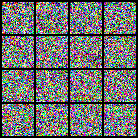
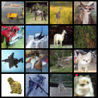

# DDPMWithLabel

> 基于 CIFAR-10 的带标签条件生成扩散模型（Denoising Diffusion Probabilistic Model with Class-Conditioned Generation）

## 项目简介

本项目实现了一个完整的 **DDPM（Denoising Diffusion Probabilistic Models）**，并在标准 UNet 架构上扩展了 **标签条件生成（class-conditioned generation）** 功能，使模型能够根据 CIFAR-10 类别标签生成指定类别的图像。

### 核心特性

- ✅ **条件生成** — 支持按类别标签生成图像（如指定生成"猫"、"飞机"等）
- ✅ **无条件生成** — 向后兼容，仍支持标准的无条件生成
- ✅ **多 GPU 训练** — 支持 `DataParallel` 多卡并行训练
- ✅ **CIFAR-10** — 基于 32×32 的 CIFAR-10 数据集

## 项目结构

```
├── Main.py                          # 主入口，配置训练/评估参数
├── Scheduler.py                     # 学习率调度器
├── Diffusion/
│   ├── __init__.py
│   ├── Diffusion.py                 # 高斯扩散训练器 & 采样器
│   ├── Model.py                     # UNet 模型（含 LabelsEmbedding）
│   └── Train.py                     # 训练 & 评估流程
├── CIFAR10/                         # CIFAR-10 数据集
├── save_weight/                     # 模型权重保存目录
├── SampledImgs/                     # 生成图像保存目录
├── OPTIMIZATION_SUMMARY.md          # 优化详情文档
└── README.md                        # 本文件
```

## 快速开始

### 环境要求

- Python 3.8+
- PyTorch 1.10+
- torchvision
- CUDA（推荐，支持多 GPU）

### 训练

```python
# 修改 Main.py 中的配置
modelConfig = {
    "state": "train",       # 训练模式
    "epoch": 100,           # 训练轮数
    "batch_size": 16,       # 批次大小
    "T": 1000,              # 扩散时间步数
    "channel": 128,         # 基础通道数
    "lr": 1e-4,             # 学习率
    "num_classes": 10,      # CIFAR-10 类别数
    # ... 更多参数见 Main.py
}

# 启动训练
python Main.py
```

### 评估 / 采样

```python
modelConfig = {
    "state": "eval",                    # 评估模式
    "test_load_weight": "ckpt_499_.pt", # 加载的权重文件
    # ... 其他参数同训练配置
}

# 启动采样
python Main.py
```

## 使用示例

### 条件训练

```python
model = UNet()
trainer = GaussianDiffusionTrainer(model, beta_1=1e-4, beta_T=0.02, T=1000)

# 带标签的训练
loss = trainer(x_0, labels)
```

### 条件采样

```python
sampler = GaussianDiffusionSampler(model, beta_1=1e-4, beta_T=0.02, T=1000)

# 生成特定类别的图像
labels = torch.tensor([3, 7])  # 生成类别 3（猫）和 7（马）的图像
sampled_imgs = sampler(noisy_image, labels)
```

### 无条件使用（向后兼容）

```python
# 仍然支持无条件生成
loss = trainer(x_0)              # 不使用标签
sampled_imgs = sampler(noisy_image)  # 无条件采样
```

## 生成效果

| 输入（带噪声） | 输出（去噪后） |
|:---:|:---:|
|  |  |

### 4×4 采样标签分布

| | **列 0** | **列 1** | **列 2** | **列 3** |
|---|----------|----------|----------|----------|
| **行 0** | Sample 0: 9 (truck) | Sample 1: 7 (horse) | Sample 2: 2 (bird) | Sample 3: 4 (deer) |
| **行 1** | Sample 4: 1 (car) | Sample 5: 0 (plane) | Sample 6: 7 (horse) | Sample 7: 4 (deer) |
| **行 2** | Sample 8: 0 (plane) | Sample 9: 3 (cat) | Sample 10: 4 (deer) | Sample 11: 3 (cat) |
| **行 3** | Sample 12: 5 (dog) | Sample 13: 0 (plane) | Sample 14: 2 (bird) | Sample 15: 5 (dog) |

## CIFAR-10 类别映射

| 索引 | 类别名称 |
|:---:|----------|
| 0 | ✈️ plane |
| 1 | 🚗 car |
| 2 | 🐦 bird |
| 3 | 🐱 cat |
| 4 | 🦌 deer |
| 5 | 🐶 dog |
| 6 | 🐸 frog |
| 7 | 🐴 horse |
| 8 | 🚢 ship |
| 9 | 🚚 truck |

## 主要修改说明

详见 [`OPTIMIZATION_SUMMARY.md`](OPTIMIZATION_SUMMARY.md)。

| 修改项 | 说明 |
|--------|------|
| [`LabelsEmbedding`](Diffusion/Model.py) | 新增标签编码模块，将类别标签映射为嵌入向量 |
| [`UNet.forward(self, x, t, label)`](Diffusion/Model.py) | 扩散模型前向传播新增 `label` 参数，支持条件生成 |

## 参考

- [Denoising Diffusion Probabilistic Models (DDPM)](https://arxiv.org/abs/2006.11239)
- [CIFAR-10 Dataset](https://www.cs.toronto.edu/~kriz/cifar.html)
